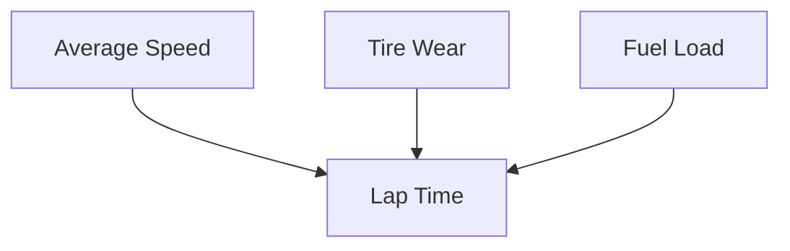

# Modeling Assumptions
Key simplifications used in the FSAE Telemetry Simulator.

The simulator aims to generate realistic‑looking telemetry without requiring a full physics engine.  
These assumptions keep the model simple, fast, and easy to extend.

---

# 1. Track & Environment

## Track Characteristics (Table)
| Parameter        | Value        | Notes                              |
|------------------|--------------|-------------------------------------|
| Track Length     | 1200 m       | Constant for all laps               |
| Sectors          | 3            | No sector‑level simulation          |
| Elevation        | None         | Flat track assumption               |
| Weather          | Constant     | No rain, wind, or temperature model |

---

# 2. Speed Model

## Speed Generation Diagram (ASCII)
```
Target Speed
     │
     ▼
Random Variation (Gaussian Noise)
     │
     ▼
Clamped to Max Speed
     │
     ▼
Final Lap Speed
```

## Speed Assumptions (Table)
| Assumption | Description |
|-----------|-------------|
| Noise     | Gaussian, independent per lap |
| Drag      | Not modeled |
| Braking   | Not modeled |
| Throttle  | Not modeled |
| Max Speed | Fixed cap |

---

# 3. Fuel Model

## Fuel Flow Diagram (Mermaid)


## Fuel Assumptions (Table)
| Parameter | Assumption |
|----------|------------|
| Burn Rate | Constant per lap |
| Density   | Constant |
| Effect on Lap Time | Linear improvement as fuel decreases |
| Engine Modes | Not modeled |

---

# 4. Tire Wear Model

## Tire Wear Curve (ASCII)
```
Wear
1.0 |                         *
0.8 |                     *
0.6 |                 *
0.4 |             *
0.2 |         *
0.0 | *  *  *  *  *  *  *  *  *  *
      1  2  3  4  5  6  7  8  9  Laps
```

## Tire Assumptions (Table)
| Assumption | Description |
|-----------|-------------|
| Wear Rate | Linear increase per lap |
| Compounds | Not modeled |
| Temperature | Not modeled |
| Grip Loss | Linear with wear |
| Recovery | None |

---

# 5. Lap Time Model

## Lap Time Influence Diagram (Mermaid)


## Lap Time Assumptions (Table)
| Factor | Modeled? | Notes |
|--------|----------|-------|
| Speed | ✔ | Base determinant |
| Tire Wear | ✔ | Linear penalty |
| Fuel Load | ✔ | Linear benefit |
| Driver Errors | ✖ | Not modeled |
| Sector Times | ✖ | No micro‑simulation |

---

# 6. Pit Stops

## Pit Stop Timeline (ASCII)
```
Lap N ──► Pit Entry ──► Fixed Stop Time ──► Pit Exit ──► Lap N+1
```

## Pit Stop Assumptions (Table)
| Assumption | Description |
|-----------|-------------|
| Stop Time | Fixed (no variation) |
| Tire Change | Instant (no extra time) |
| Refueling | Instant |
| Entry/Exit Loss | Not modeled |

---

# 7. Randomness & Noise

## Noise Model (Table)
| Component | Distribution | Notes |
|-----------|--------------|-------|
| Speed | Gaussian | Independent per lap |
| Lap Time | Gaussian | Small variation |
| Wear | Deterministic | No randomness |

---

# Purpose of These Assumptions
These simplifications allow the simulator to:
- Generate telemetry quickly  
- Stay easy to understand  
- Be extended with more physics later  

As the project evolves, each assumption can be replaced with a more advanced model.
